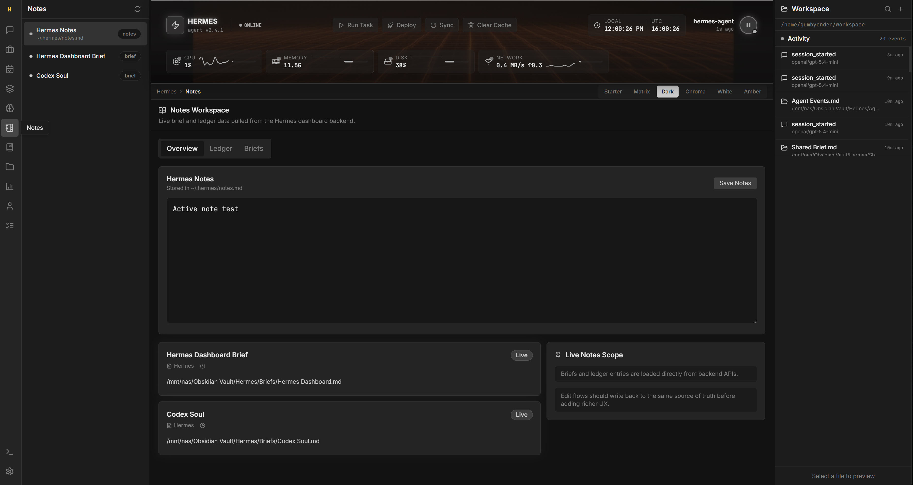
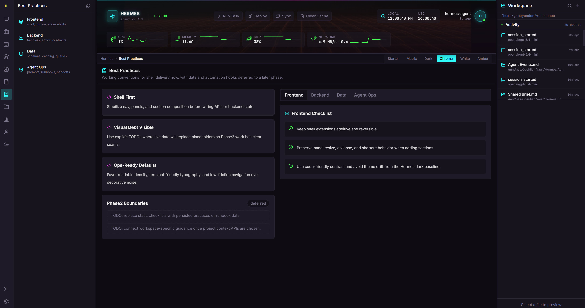
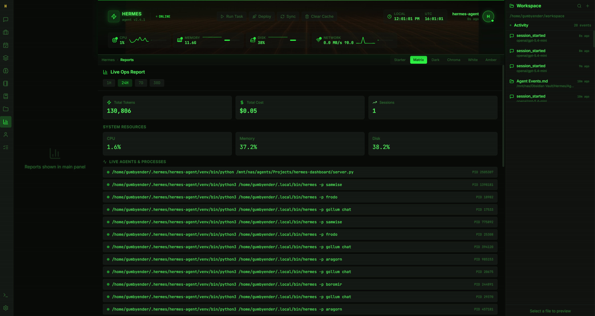

# Hermes Dashboard Matrix Plus

Hermes Dashboard Matrix Plus is a public, cleaned-up working snapshot of a heavily extended Hermes Web UI deployment. It keeps the original Python server and Hermes-agent integration, while adding a richer React dashboard with live ops data, theme-specific media, editable notes and markdown views, workspace browsing, and a more production-oriented operator experience.

This repository is intended as a publishable project snapshot with the working Matrix Plus redesign source and theme media assets included.

## Project Status

This repo reflects an in-progress but working dashboard build with these major areas wired to real backend data:

- chat streaming via Hermes backend endpoints
- live CPU, memory, disk, and network metrics
- workspaces and text-file previews
- notes persisted back to Hermes
- skills inventory with enable/disable controls
- profiles and profile file inspection
- reporting views with time filters and usage graphs
- theme-specific header video support for Matrix and Amber skins

It also contains the original server-side UI and the newer React redesign source. The React redesign is the main focus of the Matrix Plus work.

See [PROJECT_STATUS.md](PROJECT_STATUS.md) for the project-to-date writeup.

## Highlights

- Theme-aware dashboard with Matrix and Amber video-backed header treatments
- Real Hermes-backed chat flow using streaming endpoints
- Real system metrics in the header instead of randomized placeholder values
- Editable markdown and text previews for key operator workflows
- Workspace browsing with inline file preview
- Notes and Todos persisted back to Hermes state
- Reports with `1H`, `24H`, `7D`, and `30D` windows
- Profile browser for `SOUL.md`, `config.yaml`, and related profile files

## Main Features

- `Agents` surface with create, clone, switch-active, and delete flows
- Per-agent tabs for `Overview`, `Sessions`, `Config`, `Cron`, and `Gateway`
- Shared alert center backed by real ops ledger events
- Maintenance tools for update checks, apply update, and session cleanup
- Workspace explorer with text-file preview and editing
- Skills inventory with enable/disable controls and detail views
- Projects dashboard with briefs, ledger context, and a persisted Kanban board
- Notes and Todos backed by Hermes state instead of placeholder UI data
- Real reports windows and graphs for `1H`, `24H`, `7D`, and `30D`

## Updates

Latest build-session updates now in this repo:

- replaced multiple placeholder sections with real backend-driven data
- fixed theme-specific header media so Matrix and Amber each use their own video
- added a shared frontend API layer with cleaner polling and auth-expired handling
- added a real header alert center sourced from `/api/ops/ledger`
- introduced a full `Agents` management surface with profile lifecycle actions
- added per-agent session tools: rename, export, pin, archive, clear, and delete
- added editable per-agent `SOUL.md` and `config.yaml` views
- added per-agent cron controls and backend-backed gateway status/log/actions
- added a `Maintenance` section for update and cleanup operations
- added a real persisted Kanban board under `Projects`
- fixed the `Agents` crash caused by referencing the selected profile before initialization

## Screenshots

<p align="center">
  
  
</p>

<p align="center">
  
  
</p>

## Repository Layout

- `server.py`
  Python entrypoint for the dashboard server
- `api/`
  Backend routes, auth, config, helpers, streaming, workspace, and data plumbing
- `static/`
  Server-rendered login and legacy static assets
- `redesign_src2/`
  Primary React/Vite redesign source used for the Matrix Plus frontend
- `redesign-src/`
  Earlier redesign source retained for reference
- `media_assets/`
  Theme video assets served by the dashboard
- `tests/`
  Python regression and backend tests

## Requirements

### Runtime

- Linux or macOS
- Python `3.8+`
- Hermes Agent installed and configured
- Hermes config available under `~/.hermes`

### Frontend development

- Node.js `18+`
- npm `9+`

## Quick Start

First install and configure Hermes Agent. The dashboard assumes you already have a working Hermes setup and model/provider configuration.

```bash
git clone https://github.com/GumbyEnder/hermes-dashboard-matrix-plus.git
cd hermes-dashboard-matrix-plus
./start.sh
```

By default the server binds to `127.0.0.1:8787`.

To expose it on your LAN or Tailscale network, use:

```bash
HERMES_WEBUI_HOST=0.0.0.0 HERMES_WEBUI_PASSWORD=your-secret ./start.sh
```

## Configuration

Machine-local overrides belong in a non-committed `.env` file. Start from:

```bash
cp .env.example .env
```

Useful settings:

- `HERMES_WEBUI_HOST`
- `HERMES_WEBUI_PORT`
- `HERMES_WEBUI_PASSWORD`
- `HERMES_WEBUI_AGENT_DIR`
- `HERMES_WEBUI_STATE_DIR`
- `HERMES_WEBUI_DEFAULT_WORKSPACE`

## Build The React Frontend

The Matrix Plus frontend source lives in `redesign_src2/`.

```bash
cd redesign_src2
npm install
npm run build
```

This produces a Vite `dist/` bundle. In the working deployment this bundle is staged separately and served by the Python backend, but for local development the standard Vite workflow is enough.

Useful commands:

```bash
cd redesign_src2
npm install
npm run dev
npm run build
npm test
```

## Theme Media

Header video assets are served from `media_assets/`.

Current theme-specific media:

- `media_assets/hermes-dash-header-matrix.mp4`
- `media_assets/hermes-dash-amber.mp4`

The backend includes route aliasing so these can be requested from frontend asset paths under `/assets/media/...`.

## Security Notes

If you adapt this for deployment:

- keep `.env` local
- do not commit provider API keys
- do not commit Hermes state directories
- do not commit exported chat/session data

## Known Gaps

This project is actively evolving. A few areas still need more hardening:

- full end-to-end frontend automation
- richer task/workspace interaction polish
- cleaner packaging between the legacy UI and the React redesign
- broader test coverage for the newer dashboard workflows

## Credits

Built on top of Hermes Web UI and Hermes Agent, with substantial local redesign and operator-focused dashboard work layered on top.

Additional credit and inspiration:

- [`xaspx/hermes-control-interface`](https://github.com/xaspx/hermes-control-interface) for a strong operational control surface and useful parity reference points
- [`NousResearch`](https://x.com/NousResearch) for Hermes and the broader ecosystem around it
- [`Teknium`](https://x.com/Teknium) for the Hermes work and product direction that made this dashboard worth extending
